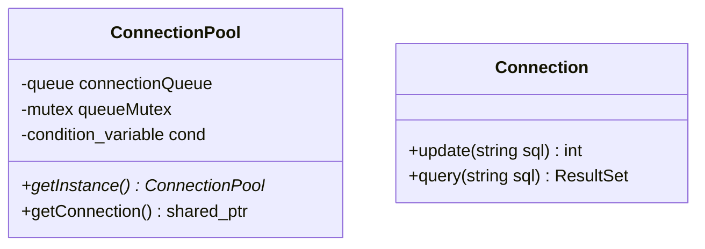

# 1. 引言

## 1.1 项目背景

在现代Web服务框架中，数据库访问性能是系统瓶颈的主要来源之一。传统的每次请求创建新连接的方式在高并发场景下，频繁的数据库连接操作会产生三大性能损耗：TCP握手/挥手的网络延迟、MySQL服务端的重复认证开销、以及连接资源的反复创建销毁。

当前主流的技术方案主要从两个维度进行优化：1. 缓存优化：通过Redis等缓存中间件减少数据库查询压力；2. 连接优化：采用连接池技术复用连接。

与主流的连接池不同的是我们基于C++实现，专注于解决以下核心问题：连接复用：避免重复的TCP/MySQL 握手过程；资源管理：通过维持一定数量的预建连接介绍实时创建/销毁带来的开销；并发控制：通过提供安全的连接获取机制实现。

## 1.2 设计目标

- 提供线程安全的数据库连接复用机制
- 支持动态扩容和收缩
- 实现连接生命周期管理
- 提供可配置的性能参数

# 2. 架构设计

## 2.1 核心组件

