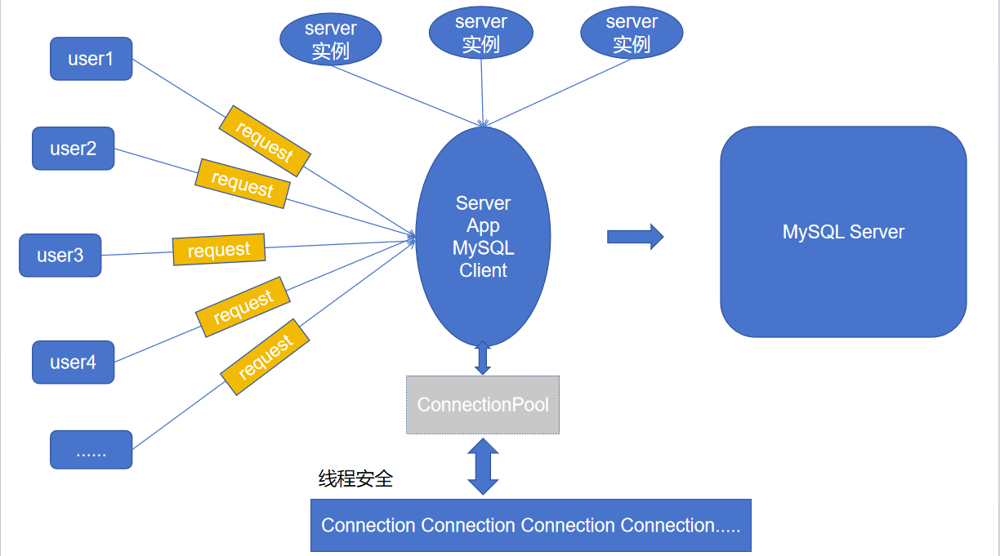

# 关键技术点

MYSQL数据库编程、单例模式、queue队列容器、C++11多线程编程、线程互斥、线程同步通信和unique_lock、基于CAS的原子整型、智能指针shared_ptr、lambda表达式、生产者-消费者模型

# 项目详情

为提升MySQL数据库(基于C/S(rdbms)设计)的访问瓶颈，除了在服务器端增加缓存服务器缓存常用的数据(减少磁盘IO)之外（例如redis），还可以增加连接池，来增加MySQL的访问速度，以提升MySQL的访问效率，在高并发情况下，大量的TCP三报文握手、MySQL Server连接认证、MySQL Server关闭连接回收资源和TCP四报文挥手所消耗的性能时间也是非常明显的，增加连接池就是为了减少这一部分的损耗。

服务器一般是多线程实现，但来自客户端的访问量可能十分巨大，其中访问数据库和连接管理显得十分耗时。

市场上比较流行的连接池包括阿里的druid，c3p0以及apach dbcp连接池，它们对于短时间内大量的数据库的增删查改操作的性能优化是相当明显，但它们有一个共同点都是基于Java实现。

综上，对于数据库访问的优化，一般有，一是缓存优化，二是连接优化。


# 连接池的特点

连接池一般包括数据库连接所有的ip地址、port端口号、用户名和密码以及它们的性能参数，例如初始化量，最大连接量，最大空闲量、连接超时时间等，该项目主要基于C++实现的连接池，主要实现了以上几个通用功能，项目没有使用系统API，跨平台特性较好。


**初始连接量（initSize）** : 
- 定义：预先建立的个数据库连接
- 工作流程： 
    - 应用访问时可直接获取可用连接
    - 使用后归还而非销毁
- 优势：避免每次请求重复建立连接的开销


**最大连接量（maxSize）** :

- 动态扩容：当不足时自动新增连接
- 上限控制：硬限制为`maxSize`（如1024）
- 资源约束：
    - 每个连接占用1个socket
    - 需为服务器程序预留socket资源
    - 回收机制：使用完毕后连接必须归还池中

**最大空闲时间（maxIdleTime）**

- 触发条件：连接数量>`initSize`且空闲超时
- 时间参数：maxIdleTime（如60秒）
- 回收策略：
    - 仅回收超额部分连接
    - 始终保持个基础连接
- 应用场景：业务高峰过后自动收缩连接规模

**连接超时时间（connectionTimeout）**

- 触发场景：连接数达`maxSize`且无空闲连接
- 等待机制：阻塞式获取，时限`connectionTimeout`（如100ms）
- 失败处理：
    - 超时未获连接则访问失败
    - 需设计重试或降级策略
- 系统保护：避免长时间阻塞消耗线程资源

# 功能实现

ConnectionPool.cpp 和 ConnectionPool.hpp ：连接池代码实现

connection.cpp 和 connection.hpp ： 数据库操作代码、增删改查代码实现



ConnectionPool采用单例实现，其控制的connection对象有多个，存放在队列之中；服务器可以创建多个线程，因此我们的ConnectionPool需要进行线程安全的单例设计。

连接池包含了以下功能点：
1. 连接池只需要一个实例，所以ConnectionPool以单例模式进行设计
2. 从ConnectionPool中可以获取和MySQL的连接Connection
3. 空闲连接Connection全部维护在一个线程安全的Connection队列中，使用线程互斥锁保证队列的线
程安全
4. 如果Connection队列为空，还需要再获取连接，此时需要动态创建连接，上限数量是maxSize
5. 队列中空闲连接时间超过maxIdleTime的就要被释放掉，只保留初始的initSize个连接就可以了，这个功能点肯定需要放在独立的线程中去做
6. 如果Connection队列为空，而此时连接的数量已达上限maxSize，那么等待connectionTimeout时间，如果还获取不到空闲的连接，那么获取连接失败，此处从Connection队列获取空闲连接，可以使用带超时时间的mutex互斥锁来实现连接超时时间
7. 用户获取的连接用shared_ptr智能指针来管理，用lambda表达式定制连接释放的功能（不真正释放
连接，而是把连接归还到连接池中）
8. 连接的生产和连接的消费采用生产者-消费者线程模型来设计，使用了线程间的同步通信机制条件变量和互斥锁

在实现过程中，我们需要实现的线程包括生产者线程、消费者线程、定时线程

# 平台选择

有关MySQL数据库编程、多线程编程、线程互斥和同步通信操作、智能指针、设计模式、容器等等这些
技术在C++语言层面都可以直接实现，因此该项目选择直接在windows平台上进行开发，当然放在
Linux平台下用g++也可以直接编译运行。

# 压力测试

验证数据的插入操作所花费的时间，第一次测试使用普通的数据库访问操作，第二次测试使用带连接池
的数据库访问操作，对比两次操作同样数据量所花费的时间，性能压力测试结果如下：

| 数据量 | 未使用连接池花费的时间 | 使用连接池花费的时间 |
|--| -- | ---| 
| | | |


# MySQL数据库编程

## 环境准备

### 1. 更新系统包列表

首先确保系统包是最新的：
```shell
sudo apt update
```
### 2.安装MySQL服务器

安装MySQL服务器软件包
```shell
sudo apt install mysql-server
```
在Ubuntu/Debain系统中，安装 `mysql-server` 时，系统会默认安装一个最小化的客户端组件（如`mysql`命令行工具）,作为服务端的依赖项。

### 3. 登录MySQL

再次之前，可以运行安全配置向导配置相应的安全策略，可以执行以下命令：
```shell
sudo mysql_secure_installation
```
使用`root`账户进行登录,可以执行以下命令：
```shell
sudo mysql -u root -p
```


## 2.创建测试用户

### 1) 创建专用数据库

```mysql
-- 创建业务数据库（与配置中的 dbname 对应）
CREATE DATABASE mydatabase 
  CHARACTER SET utf8mb4 
  COLLATE utf8mb4_unicode_ci;

-- 验证创建结果
SHOW DATABASES LIKE 'mydatabase';
```

### 2) 创建专用用户并授权

```mysql
-- 创建用户（与配置中的 username/password 对应）
CREATE USER 'test'@'%' IDENTIFIED BY 'mypassword';

-- 授予权限（生产环境应根据需要缩小权限范围）
GRANT ALL PRIVILEGES ON mydatabase.* TO 'test'@'%';

-- 立即生效
FLUSH PRIVILEGES;

-- 验证用户权限
SHOW GRANTS FOR 'test'@'%';
```

### 3) 测试连接

```mysql
# 使用新账号连接测试
mysql -u test -p -h 127.0.0.1 -D mydatabase
# 输入密码 mypassword 后应能成功进入
```
